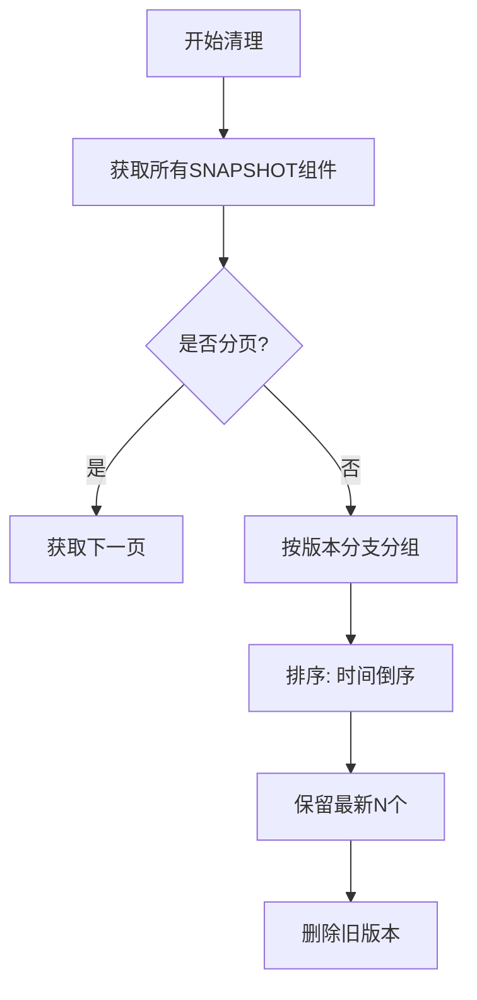

# Nexus Snapshot Cleanup Tool


## 🎯 解决问题场景

**企业级痛点**：
1. Nexus 仓库中 SNAPSHOT 版本无限增长导致：
   - 存储成本飙升（尤其对大型二进制文件）
   - 仓库性能下降（索引膨胀）
   - 合规审计困难

2. 传统清理方案不足：
   - 社区版Nexus 内置策略无法按版本分支清理
   - 手动清理易误删关键版本
   - 缺乏可视化操作日志

**典型应用场景**：
- CI/CD 流水线中的自动化空间回收
- 发布前的版本整理（保留可追溯的最近版本）
- 存储配额告急时的紧急清理

## 🛠️ 核心功能

### 智能版本管理
```python
# 自动识别版本模式：
# 格式：<base-version>-<timestamp>-<build-number>
# 示例：1.0.0-SNAPSHOT-20240101.120000-1
def parse_snapshot_version(version_str: str) -> Optional[Tuple[str, datetime, int]]:
    ...
```

### 精确清理策略
| 策略维度        | 配置方式                  | 示例值       |
|----------------|--------------------------|-------------|
| 保留版本数      | `RETAIN_COUNT`           | 3           |
| 仓库筛选        | `REPOSITORY_NAME`        | maven-snapshots |
| 模拟运行        | `DRY_RUN`                | true/false  |

### 企业级特性
- **无损操作**：支持预检查模式(`DRY_RUN`)
- **增量处理**：自动分页获取组件(10,000+版本支持)
- **跨版本追踪**：按`<group>:<artifact>`智能分组

## 📊 技术指标



**性能基准**（测试环境）：
- 处理速度：~500组件/分钟
- 内存占用：< 100MB
- API 调用：平均3次/组件

## 🚀 快速开始

### 前置要求
- Nexus 3.x+ (REST API v1)
- Python 3.9+ 或 Docker

### 配置示例
```bash
# .env 文件
NEXUS_URL=http://nexus.example.com
NEXUS_USER=cleanup-bot
NEXUS_PASS=s3cr3t
RETAIN_COUNT=3  # 每个分支保留3个最新版本
```

### 运行方式
**Docker 方式**：
```bash
docker run -d --env-file .env ghcr.io/freemankevin/clean-snapshots/nexus-cleanup:latest
```

**Kubernetes 示例**：
```yaml
apiVersion: apps/v1
kind: Deployment
spec:
  template:
    spec:
      containers:
      - name: cleaner
        image: ghcr.io/freemankevin/clean-snapshots/nexus-cleanup:latest
        envFrom:
        - secretRef:
            name: nexus-cleanup-secrets
```